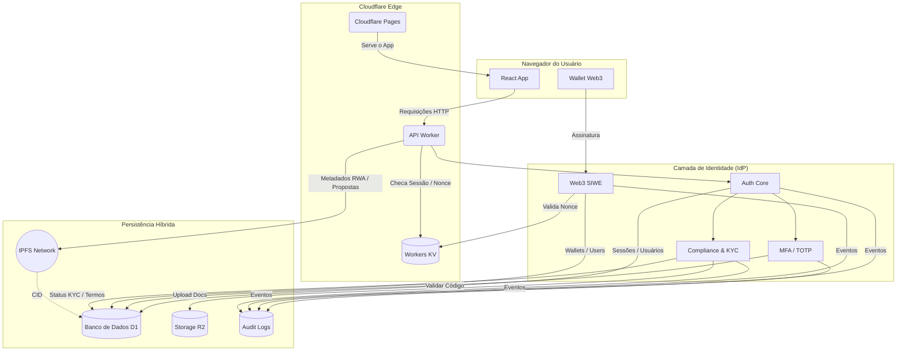

# Governance System 🚀

O Governance System é uma plataforma de governança institucional e identidade digital, projetada para operar em cenários de DAO, Web3 e RWA (Real World Assets).

Mais do que um sistema de votação ou gestão administrativa, este projeto implementa um Identity Provider (IdP) soberano, com segurança de nível financeiro, compliance jurídico e rastreabilidade completa.

## 🧭 Visão Geral

O sistema foi concebido para:

- 🏛️ Sustentar governança descentralizada (DAO)
- 🌱 Operar em contextos de cooperativismo
- 🧾 Atender requisitos de compliance e auditoria
- 🦊 Integrar identidade Web3 (SIWE) com Web2 tradicional
- 🛡️ Garantir segurança bancária (MFA, sessões rastreáveis)

Toda a arquitetura roda no edge da Cloudflare, priorizando latência mínima, escalabilidade global e simplicidade operacional.

## 🏗️ Arquitetura

O Governance System utiliza uma arquitetura Jamstack + Edge Computing, com separação clara entre interface, identidade, governança e persistência de dados.

### Stack Tecnológica

#### Front-end

- SPA em React + TypeScript
- Material-UI (MUI) para UI responsiva e acessível

#### Edge & Backend

- Cloudflare Pages para servir o front-end
- Cloudflare Workers como API serverless
- Cloudflare KV (Workers KV) para cache de ultra-baixa latência:
  - Nonces de autenticação (SIWE)
  - Sessões revogadas
  - Preços e estados temporários de ativos (RWA)

#### Identidade & Segurança (IdP)

- Autenticação por email/senha
- MFA / TOTP (Google Authenticator, Authy, etc.)
- Web3 SIWE (Sign-In with Ethereum)
- Sessões rastreáveis com fingerprint heurístico

#### Persistência Híbrida (Web2 + Web3)

- Cloudflare D1 (SQLite serverless): dados relacionais, perfis, sessões e logs
- Cloudflare R2 (Object Storage): documentos KYC e arquivos privados
- IPFS (InterPlanetary File System): metadados imutáveis de ativos RWA e propostas da DAO

#### Auditoria

- Logs forenses de todas as ações críticas
- Trilhas auditáveis para compliance e disputas jurídicas

## 🔐 Identidade como Núcleo do Sistema

A identidade é o eixo central da arquitetura. Todas as ações — governança, votos, movimentações, permissões — partem de um usuário autenticado, auditável e com nível de garantia de autenticação (AAL) conhecido.

O sistema suporta:

- Contas tradicionais (email + senha)
- Contas Web3 (carteiras Ethereum)
- Contas híbridas (email + wallet)
- Contas com múltiplas carteiras (1:N)

## 🧮 Authentication Assurance Levels (AAL)

O sistema adota níveis formais de garantia de autenticação, permitindo controle de risco e governança baseada em identidade:

| Nível | Descrição | Requisitos |
| :---- | :--- | :--- |
| AAL1 | Identidade Básica | Email + senha verificada |
| AAL2 | Identidade Forte | Email + senha + MFA/TOTP |
| AAL3 | Identidade Institucional | MFA + Wallet vinculada + KYC aprovado |

Cada ação sensível (voto, emissão de ativo, proposta, admin) exige um AAL mínimo configurável.

## 🔑 Fluxo de Criação de Credencial

1.  **Registro Inicial**
    - Usuário informa email e senha
    - Senha é armazenada usando hash forte (Argon2id)
2.  **Verificação de Email**
    - Token de verificação com expiração curta
3.  **Criação de Sessão**
    - JWT de curta duração
    - Refresh token com rotação obrigatória (one-time-use)
4.  **Ativação de MFA (Opcional / Obrigatório por Perfil)**
    - Geração de segredo TOTP
    - Validação dupla antes de ativação
5.  **Vinculação Web3 (Opcional)**
    - Geração de nonce via Workers KV
    - Assinatura SIWE pela wallet
    - Persistência do vínculo User ↔ Wallet
6.  **Evolução para AAL3 (KYC)**
    - Upload de documentos (R2)
    - Aprovação manual ou automatizada
    - Elevação do nível de garantia

## 🔄 Diagrama de Fluxo da Arquitetura


---

## 💾 Estratégia de Dados: Híbrida e Soberana

O sistema adota uma estratégia que equilibra privacidade, performance e transparência pública.

### 🔒 Dados Sensíveis (Privados)

- Emails, senhas, documentos pessoais e status KYC
- **Tecnologia**: Cloudflare D1 + R2
- Criptografados e protegidos por controle de acesso

### ⚡ Dados de Performance (Edge Cache)

- Sessões revogadas
- Nonces de login Web3
- Cotações e estados temporários de ativos
- **Tecnologia**: Cloudflare Workers KV

### 🌐 Dados Públicos e Imutáveis

- Metadados de ativos RWA
- Propostas e resultados finais de votações
- **Tecnologia**: IPFS
- Cada publicação no IPFS gera um CID (Content Identifier) que prova matematicamente a imutabilidade do conteúdo.

## 🛡️ Modelo de Ameaças (STRIDE) — Auth Core

| Categoria | Mitigação |
| :--- | :--- |
| **S**poofing | MFA, SIWE, verificação de email |
| **T**ampering | IPFS (imutabilidade), hash criptográfico |
| **R**epudiation | Logs forenses e trilhas auditáveis |
| **I**nformation Disclosure| Criptografia, segregação de dados |
| **D**enial of Service | Rate limiting, edge caching |
| **E**levation of Privilege | AAL mínimo por ação, roles explícitos |

## 📂 Estrutura de Diretórios (Resumo)

```
src/
├── db/
│   └── schema.ts            # Users, Sessions, Wallets, Audit Logs
├── routes/
│   └── core/auth/
│       ├── index.ts         # Login, Refresh, Logout
│       ├── session.ts       # /me, Perfil
│       ├── password.ts      # Recuperação de senha
│       ├── mfa.ts           # MFA / TOTP
│       ├── web3.ts          # SIWE & Wallets
│       ├── compliance.ts    # Termos & KYC
│       └── admin.ts         # Roles & Banimento
├── services/
│   └── audit.ts             # Logger global de auditoria
└── utils/
    └── auth-guard.ts        # Middleware de autenticação
```

## ⚙️ Setup Rápido

### Pré-requisitos

- Node.js v24+
- pnpm v10+
- Wrangler CLI

### Variáveis de Ambiente (`.dev.vars`)

```
JWT_SECRET=super_secret_key
REFRESH_TOKEN_SECRET=another_secret
R2_BUCKET_NAME=governance-docs
```

## 🏁 Status do Projeto

🟡 Em desenvolvimento ativo — arquitetura de identidade consolidada, pronta para ambientes regulados, DAOs e tokenização de ativos.

Este repositório implementa um núcleo soberano de identidade e governança institucional para Web2 + Web3.
