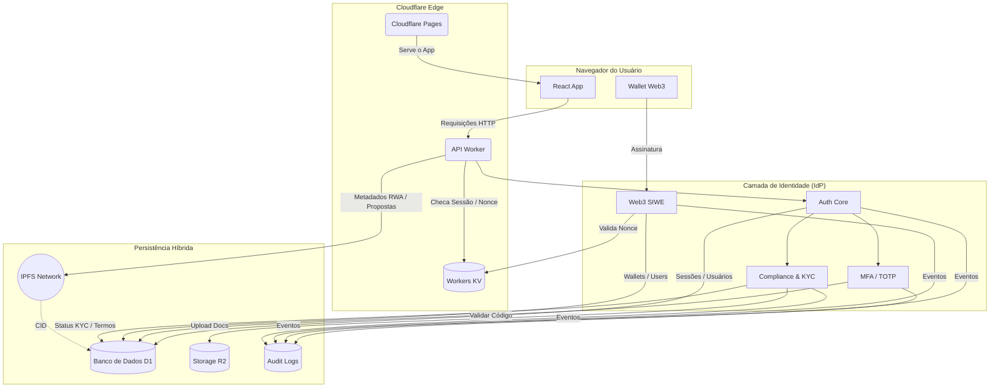

# 🚀 Governance System: Identidade e Governança Institucional


O Governance System é uma plataforma de governança institucional e identidade digital, projetada para operar em cenários de DAO, Web3 e RWA (Real World Assets).

---

## 📑 Índice da Documentação

* **1. Introdução**
    * [1.1. Governance System](#11-governance-system)
    * [1.2. Objetivo do Projeto](#12-objetivo-do-projeto)
    * [1.3. Contextos de Uso](#13-contextos-de-uso)
* **2. Visão Geral do Sistema**
    * [2.1. Princípios de Design](#21-princípios-de-design)
    * [2.2. Escopo Institucional](#22-escopo-institucional)
    * [2.3. Execução em Edge Computing](#23-execução-em-edge-computing)
* **3. Arquitetura Geral**
    * [3.1. Padrão Arquitetural](#31-padrão-arquitetural)
    * [3.2. Separação de Camadas](#32-separação-de-camadas)
* **4. Stack Tecnológica**
    * [4.1. Front-end](#41-front-end)
    * [4.2. Edge & Backend](#42-edge--backend)
    * [4.3. Identidade & Segurança](#43-identidade--segurança)
    * [4.4. Persistência Híbrida](#44-persistência-híbrida)
    * [4.5. Auditoria e Observabilidade](#45-auditoria-e-observabilidade)
* **5. Identidade como Núcleo do Sistema**
    * [5.1. Conceito de Identidade Soberana](#51-conceito-de-identidade-soberana)
    * [5.2. Tipos de Conta](#52-tipos-de-conta)
    * [5.3. Rastreabilidade e Auditoria de Ações](#53-rastreabilidade-e-auditoria-de-ações)
* **6. Authentication Assurance Levels (AAL)**
    * [6.1. Definição de AAL](#61-definição-de-aal)
    * [6.2. Níveis de Garantia de Autenticação](#62-níveis-de-garantia-de-autenticação)
* **7. Fluxos de Autenticação e Credenciais**
    * [7.1. Registro Inicial](#71-registro-inicial)
    * [7.2. Verificação de Email](#72-verificação-de-email)
    * [7.3. Gerenciamento de Sessão](#73-criação-e-gerenciamento-de-sessão)
    * [7.4. MFA / TOTP](#74-mfa--totp)
    * [7.5. Integração Web3 (SIWE)](#75-integração-web3-siwe)
    * [7.6. Elevação de Garantia (KYC – AAL3)](#76-elevação-de-garantia-kyc--aal3)
* **8. Arquitetura de Integração Web3**
* **9. Estratégia de Dados**
    * [9.1. Visão Geral da Estratégia Híbrida](#91-visão-geral-da-estratégia-híbrida)
    * [9.2. Dados Sensíveis](#92-dados-sensíveis-privados)
    * [9.3. Dados de Performance](#93-dados-de-performance-edge-cache)
    * [9.4. Dados Públicos e Imutáveis](#94-dados-públicos-e-imutáveis)
* **10. Auditoria, Logs e Compliance**
* **11. Modelo de Ameaças (STRIDE)**
* **12. Diagrama de Arquitetura**
* **13. Estrutura do Repositório**
* **14. Configuração e Setup**
* **15. Status do Projeto**
* **16. Considerações Finais**

---

## 1. Introdução

### 1.1. Governance System
O Governance System é uma plataforma de governança institucional e identidade digital, projetada para operar em cenários de DAO, Web3 e RWA (Real World Assets).

### 1.2. Objetivo do Projeto
Mais do que um sistema de votação ou gestão administrativa, este projeto implementa um Identity Provider (IdP) soberano, com segurança de nível financeiro, compliance jurídico e rastreabilidade completa.

### 1.3. Contextos de Uso
- 🏛️ Sustentar governança descentralizada (DAO)
- 🌱 Operar em contextos de cooperativismo
- 🧾 Atender requisitos de compliance e auditoria
- 🦊 Integrar identidade Web3 (SIWE) com Web2 tradicional
- 🛡️ Garantir segurança bancária (MFA, sessões rastreáveis)

## 2. Visão Geral do Sistema

### 2.1. Princípios de Design
O sistema foi concebido para priorizar latência mínima, escalabilidade global e simplicidade operacional.

### 2.2. Escopo Institucional
A plataforma é desenhada para suportar operações que exigem um alto grau de confiança e verificação, adequadas para ambientes corporativos e regulados.

### 2.3. Execução em Edge Computing
Toda a arquitetura roda no edge da Cloudflare, garantindo performance e segurança distribuídas globalmente.

## 3. Arquitetura Geral

### 3.1. Padrão Arquitetural
O Governance System utiliza uma arquitetura Jamstack + Edge Computing, com separação clara entre interface, identidade, governança e persistência de dados.

### 3.2. Separação de Camadas
A arquitetura é dividida em camadas lógicas para garantir manutenibilidade e escalabilidade.
    * **Interface (Front-end):** SPA em React + TypeScript.
    * **Edge / Backend:** Cloudflare Workers como API serverless.
    * **Identidade (IdP):** Núcleo de autenticação e autorização.
    * **Governança:** Módulos de votação e gestão.
    * **Persistência de Dados:** Solução híbrida com D1, R2 e IPFS.

## 4. Stack Tecnológica

#### 4.1. Front-end
- SPA em React + TypeScript
- Material-UI (MUI) para UI responsiva e acessível

#### 4.2. Edge & Backend
- Cloudflare Pages para servir o front-end
- Cloudflare Workers como API serverless
- Cloudflare KV (Workers KV) para cache de ultra-baixa latência:
  - Nonces de autenticação (SIWE)
  - Sessões revogadas
  - Preços e estados temporários de ativos (RWA)

#### 4.3. Identidade & Segurança
- Autenticação por email/senha
- MFA / TOTP (Google Authenticator, Authy, etc.)
- Web3 SIWE (Sign-In with Ethereum)
- Sessões rastreáveis com fingerprint heurístico

#### 4.4. Persistência Híbrida
- Cloudflare D1 (SQLite serverless): dados relacionais, perfis, sessões e logs
- Cloudflare R2 (Object Storage): documentos KYC e arquivos privados
- IPFS (InterPlanetary File System): metadados imutáveis de ativos RWA e propostas da DAO

#### 4.5. Auditoria e Observabilidade
- Logs forenses de todas as ações críticas
- Trilhas auditáveis para compliance e disputas jurídicas

## 5. Identidade como Núcleo do Sistema

### 5.1. Conceito de Identidade Soberana
A identidade é o eixo central da arquitetura. Todas as ações — governança, votos, movimentações, permissões — partem de um usuário autenticado, auditável e com nível de garantia de autenticação (AAL) conhecido.

### 5.2. Tipos de Conta
- **Contas Tradicionais:** email + senha
- **Contas Web3:** carteiras Ethereum
- **Contas Híbridas:** email + wallet
- **Múltiplas Carteiras (1:N):** Um usuário pode vincular várias carteiras.

### 5.3. Rastreabilidade e Auditoria de Ações
Todas as ações críticas geram logs forenses, garantindo uma trilha auditável completa.

## 6. Authentication Assurance Levels (AAL)

### 6.1. Definição de AAL
O sistema adota níveis formais de garantia de autenticação, permitindo controle de risco e governança baseada em identidade.

### 6.2. Níveis de Garantia de Autenticação
| Nível | Descrição | Requisitos |
| :---- | :--- | :--- |
| AAL1 | Identidade Básica | Email + senha verificada |
| AAL2 | Identidade Forte | Email + senha + MFA/TOTP |
| AAL3 | Identidade Institucional | MFA + Wallet vinculada + KYC aprovado |

Cada ação sensível (voto, emissão de ativo, proposta, admin) exige um AAL mínimo configurável.

## 7. Fluxos de Autenticação e Credenciais

#### 7.1. Registro Inicial
1. Usuário informa email e senha.
2. Senha é armazenada usando hash forte (Argon2id).

#### 7.2. Verificação de Email
- Token de verificação com expiração curta é enviado ao email do usuário.

#### 7.3. Criação e Gerenciamento de Sessão
- JWT de curta duração.
- Refresh token com rotação obrigatória (one-time-use).

#### 7.4. MFA / TOTP
- Geração de segredo TOTP para apps como Google Authenticator.
- Validação dupla antes de ativação.

#### 7.5. Integração Web3 (SIWE)
- Geração de nonce via Workers KV.
- Assinatura SIWE pela wallet.
- Persistência do vínculo User ↔ Wallet.

#### 7.6. Elevação de Garantia (KYC – AAL3)
- Upload de documentos (R2).
- Aprovação manual ou automatizada.
- Elevação do nível de garantia do usuário.

## 8. Arquitetura de Integração Web3
*Esta seção detalha a integração com o ecossistema Web3, incluindo a gestão de carteiras e a validação de assinaturas.*

## 9. Estratégia de Dados

### 9.1. Visão Geral da Estratégia Híbrida
O sistema adota uma estratégia que equilibra privacidade, performance e transparência pública.

### 9.2. Dados Sensíveis (Privados)
- **O quê:** Emails, senhas, documentos pessoais e status KYC.
- **Tecnologia:** Cloudflare D1 + R2.
- **Proteção:** Criptografados e protegidos por controle de acesso.

### 9.3. Dados de Performance (Edge Cache)
- **O quê:** Sessões revogadas, nonces de login Web3, cotações e estados temporários de ativos.
- **Tecnologia:** Cloudflare Workers KV.

### 9.4. Dados Públicos e Imutáveis
- **O quê:** Metadados de ativos RWA, propostas e resultados finais de votações.
- **Tecnologia:** IPFS.
- **Garantia:** Cada publicação no IPFS gera um CID (Content Identifier) que prova matematicamente a imutabilidade do conteúdo.

## 10. Auditoria, Logs e Compliance
*Esta seção descreve a estratégia para garantir a rastreabilidade completa das ações e a conformidade com requisitos regulatórios.*

## 11. Modelo de Ameaças (STRIDE)
| Categoria | Mitigação |
| :--- | :--- |
| **S**poofing | MFA, SIWE, verificação de email |
| **T**ampering | IPFS (imutabilidade), hash criptográfico |
| **R**epudiation | Logs forenses e trilhas auditáveis |
| **I**nformation Disclosure| Criptografia, segregação de dados |
| **D**enial of Service | Rate limiting, edge caching |
| **E**levation of Privilege | AAL mínimo por ação, roles explícitos |

## 12. Diagrama de Arquitetura


## 13. Estrutura do Repositório
```
src/
├── db/
│   └── schema.ts            # Users, Sessions, Wallets, Audit Logs
├── routes/
│   └── core/auth/
│       ├── index.ts         # Login, Refresh, Logout
│       ├── session.ts       # /me, Perfil
│       ├── password.ts      # Recuperação de senha
│       ├── mfa.ts           # MFA / TOTP
│       ├── web3.ts          # SIWE & Wallets
│       ├── compliance.ts    # Termos & KYC
│       └── admin.ts         # Roles & Banimento
├── services/
│   └── audit.ts             # Logger global de auditoria
└── utils/
    └── auth-guard.ts        # Middleware de autenticação
```

## 14. Configuração e Setup

### 14.1. Pré-requisitos
- Node.js v24+
- pnpm v10+
- Wrangler CLI

### 14.2. Variáveis de Ambiente (`.dev.vars`)
```
JWT_SECRET=super_secret_key
REFRESH_TOKEN_SECRET=another_secret
R2_BUCKET_NAME=governance-docs
```

## 15. Status do Projeto
🟡 **Em desenvolvimento ativo** — arquitetura de identidade consolidada, pronta para ambientes regulados, DAOs e tokenização de ativos.

## 16. Considerações Finais
Este repositório implementa um núcleo soberano de identidade e governança institucional para Web2 + Web3.
